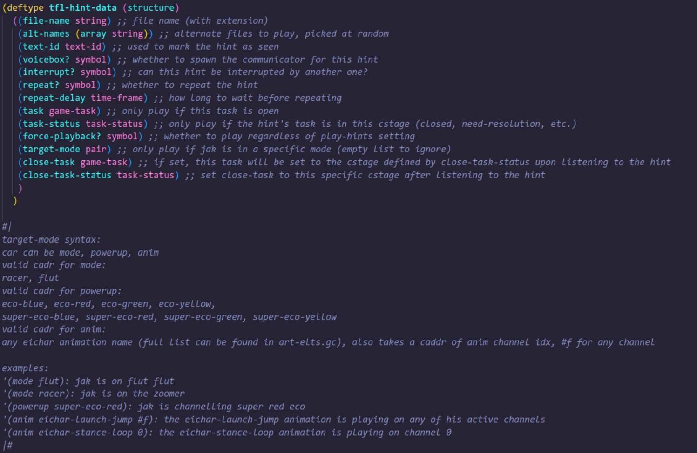
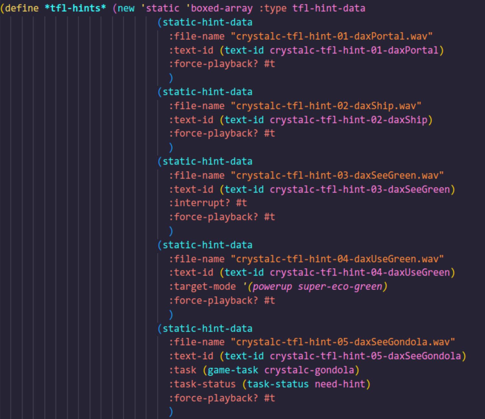
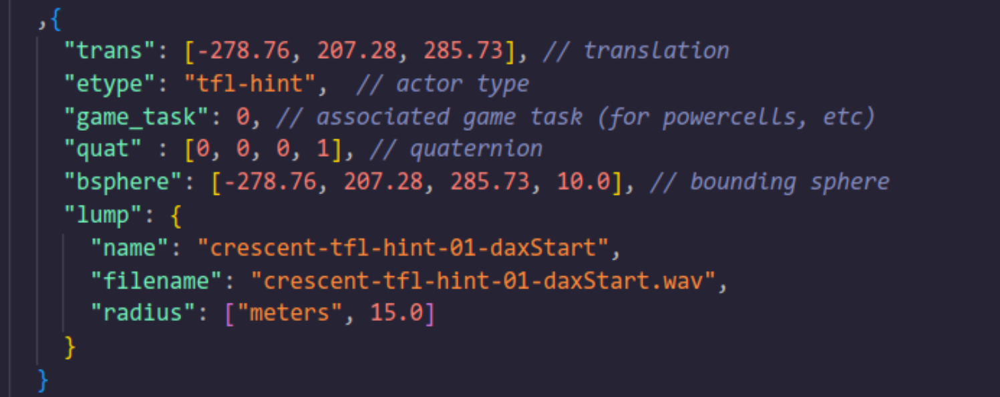

This blog will spoil a lot of the update’s content. I would encourage you to play it for yourself before reading.

As this is a pretty big release with a lot of moving parts, I figured I’d write a little blog to answer some of the questions you might have or get some behind the scenes if you’re interested, as I’ve mostly been working in the dark. Only a select few have seen different steps in the progress of this project.

{/* truncate */}

## FAQ

I’ll start with a small Q&A of probably the most likely questions:

#### How long have you been working on this?

I started working on this mod in June 2022, with the first release being published on January 9th 2023.

After that first release, I gave myself a few weeks off the project before diving back into it.

There was around 350 hours of work done on the mod for the first release. Steam has actually stopped tracking my hours on Blender a while back, so I don’t have a precise estimate, but I’ve been working on this new release for over 10 months at a much higher density than the first release so I think I can confidently say that the total time I’ve been working on this for is easily over 1000 hours, probably in the ballpark of 1300 to 1600 hours total.

#### Are you working on this on your own?

Not completely nowadays, see the “New Contributors” section for more info on this.

#### How is this made?

I’ll try to be very concise here as this topic could be several pages in itself. In short, you need to create the level’s geometry using 3D modeling software. I’m using Blender myself, as the OpenGOAL devs made some tools specifically for Blender. And also because Blender is an amazing software, don’t listen to Zed.

Along with the level geometry, you’ll also need to edit some code in OpenGOAL to be able to add your level in but also to add collectables, water, sounds, particles and everything else.

Most of the geometry I’ve been using for my level was custom-made by me. The textures are a mix of edited textures from the main game and fully custom ones as well.

I’ve made an incomplete and now somewhat outdated tutorial which should give you a more complete idea.

#### Are there any limitations?

At the moment, some custom level tools are not available yet and are the reasons I haven’t implemented some specific aspects into the game. Hopefully, this release motivates some of the devs to work on these things. *wink wink*

Here’s a short list of the main missing features at the moment:
- Importing custom models and skeleton to replace/create new actors.
- Texture transparency for things like grass, ice and others.
- Reflections for things like Precursor Metal.
- Sky rendering in custom levels. (Need to use a “fake” sky sphere instead for the time being.)
- Nav meshes, Jak 1’s system to make enemies or NPCs move around an area, avoid obstacles and path toward Jak. This means most enemies can’t be added at the moment. A few enemies don’t use nav meshes and can be implemented.

#### Are you looking for help for anything?

I don’t have anything in particular right now where I do need help. If you do have a specific skill set that you think would be useful for the project, then you can always contact me, but be aware that it’s pretty likely to be a negative answer. You can read the “New Contributors” section for more info on my mindset in this project overall.

#### Can we support you or the project with donations?

Short answer, no.

Long answer; this is a passion project for me, while I’ve put several hundreds of hours into this and will most likely put in a lot more, I do not see it as wasted time because I’m not making money out of it.

I’ve always loved making levels for games. (CS 1.6, LBP, Portal 2, Dustforce and I’m probably forgetting some) So even just this whole thing being possible thanks to OpenGOAL is a dream come true for me. Adding money to the mix would change how I view the project and it’d definitely lose something. I’m making money elsewhere. I'd rather this passion project stay exactly that.

## New Contributors

I’ll start this part with some history on how this project started. As said in the FAQ, this project was started pretty much as soon as custom level became a possibility in OpenGOAL. I even started writing and drawing some ideas a bit before, while waiting for the feature.

My plans from the beginning have been stupidly large in terms of scope and… they’ve not really changed much. If anything, they’ve grown a bit over time.

I was, from the very start, fully committed to pretty much doing everything on my own. Which sounds kind of ridiculous when compared to the scale of the project, but the rate at which I’ve been able to work and complete things, this has actually been pretty good. I don’t think I could have expected to have done this much after 17 months.

The main reason for my mindset is pretty much an egotistical one. This is probably going to be one of my biggest, if not the biggest, projects I will ever make. I want this to be almost entirely my artistic vision and to have control over every minute detail. Having people help, even for work that seems to be repetitive and unimportant, felt like I’d lose some control over the creative process and, as silly as that might sound, was not something I was ready to accept.

When I released the first version with Crystal Cave, I got a lot of people messaging me, offering help. There was one aspect where I was actually willing to get some help, as it’s an aspect I don’t think I’d be able to do myself: Music.

### Pex

One of the people messaging me about offering help was none other than Pex. Maybe the name doesn’t ring a bell, but you’ve probably heard some of the soundtracks he’s made for the cut Jak and Daxter levels mentioned in the Design Bible. You can listen to them here.

I don’t think I could have hoped for someone better for the job, short of the original composer of Jak 1’s OST. Pex has done an incredible job on the soundtrack for TFL so far and been great to work with.

### Hat Kid

Another aspect of the project I was having trouble with was the programming aspect. While I have some very small basic knowledge on it, it was a huge undertaking to learn everything I needed to do some of the things I would like to be in the mod.

However, about 3 months ago. I decided to message Hat Kid to see if he wanted to be more involved in the project to help me achieve all those crazy things I wanted to implement.

I can’t thank him enough for all the work he’s been able to do in such a short period of time, which includes:
- Adding support for ambients in custom levels. Those allow us to add things like ambient audio, but also level name pop-ups.
- Fixing many crashes related to custom levels.
- Adding support to include models and textures in custom levels. This allows us to use almost every single actor in the game in custom levels. Probably the most significant change for custom levels over the whole year.
- Creation of the custom “Super Eco” powers.
- Custom music system roughly based on Barg and Zed’s audio hack with automatic level detection (only need to add the level name to a list and the corresponding audio file), pausing, volume adjustment based on the in-game music volume setting and fade in/fade out.
- Custom level hint system, also using the same (heavily modified) audio hack that is very customisable (can repeat voice lines, interrupt other playing ones if wanted, only play based on special conditions/task status/etc.).
- Sinking and emerging particle spawner for platforms.
- And finally, a working gondola!

I’ve probably even missed some other things, but as you can see, this list is getting really big. You can find a much more detailed explanation in Hat Kid’s written section later in this blog.

He’s also helped me a lot with some of the custom code I tried to write, such as the electric arcs in Crystal Cave. 

### Voice Actors

Maybe a bit of a controversial topic, but I’ll let you know how I got there to clear things up.

I’ve wanted to add voice lines to the project, both to tell the story I’ve been writing for this mod as well as to help the player, so they’re not completely lost and have a general idea of what they need to do.

To do so, I’ve actually had a few different ways to approach the situation. I first wanted to actually message the original voice actors of Jak 1. First, to see if they would be interested, but then, more realistically, if they were fine with me using AI voices trained on their work.

I was not really able to find contact information for Daxter’s and Keira’s voice actors and Samos’ VA, Warren Burton, is not with us anymore.

Which made me decide to look for impersonators instead. I’ve sent out a form on a few different platforms but got very few replies. One of the few I got was from a guy that has already been working on AI models for most of the characters in the franchise. At that point, it was one of my last options if I did want to have voice lines, so I’ve decided to go that route.

As mentioned earlier, I’m not going to make any money out of this project, so I’m not trying to profit off of these voice actors’ work, but if any of them wish for me to remove the lines from the mod, it’ll be done the next day.

The models have been trained by Netguard and here’s the voice actor for each of the characters, as you do still need someone acting out the lines for the best results:
- Michael Gross as Daxter
- Nohmyy as Keira
- Liam Donovan and Michael Gross as Samos

## Crystal Cave Improvements

Crystal Cave has received a few additions and finishing touches.

### Paths!

Custom paths have been figured out by Luminar Light a couple of months ago. Thanks to them, I’ve been able to make good use of this feature. The platforms in Crystal Cave are now moving!

### Functional Water

Another big missing part of Crystal Cave has now also been added, water will now work thanks to a change Hat Kid also made not too long after the first release. The visual for those is not proper yet as right now, I’d need to be able to match the area perfectly with some water that already exists in the game as those are just 3d models and we can’t import custom ones yet as mentioned earlier.

### Custom Jak Lighting

As some have noticed, some entities in Crystal Cave have custom lighting depending on the different areas of the level that have different lighting. This has also been added to Jak as he moves around the level. It’s a pretty small detail, but works really well, so Jak doesn’t look out of place.

### Super Green Eco and New Cell

The first Super Green Eco you’ll stumble upon. It makes you invincible to most damage sources and temporarily increases the maximum Green Eco pill count to 100, even after the powerup runs out, allowing you to take five hits. It allows you to collect the extra cell without taking damage on the Dark Eco infected ground.

### Electric Arc in the Precursor Ship

Mostly heavily edited code from the flame pots seen in the robot room of Spider Cave with custom particle work, adding a new hazard in the ship area.

### Ambients

Ambients allow us to display the name of the level as well as playing some ambient sounds all over the level. The waterfalls aren’t silent anymore!

## New Levels!

I’m sure most people were expecting a new level in this update, but hopefully the second one was a nice surprise as well!

These new levels are obviously the bulk of the work of the past 10 months.

### Crescent Top

When you come out of Crystal Cave, you will arrive on this crescent-shaped plateau, hence the name.

It serves as a hub to other levels. However, as opposed to the base game’s hubs that have pretty limited gameplay, I’ve wanted to make it a fully fleshed out level with loads of different gameplay features.

The level is built to be a mix of on-foot and zoomer gameplay within the same area. This has been quite a challenging idea, as a fun area to traverse on the zoomer isn’t as good on foot and vice versa. I’ve tried to make the level flow really well when you do know the “route”, so I hope it won’t feel too sluggish when playing through it for the first time.

[Here’s a timelapse of a few recordings I took while working on Crescent Top played at 50 times the speed.](https://www.youtube.com/watch?v=XN9eEdFy4YQ)

### Energy Bay

The second new level where you’ll have to go before being able to finish Crescent Top itself, as you’ll unlock the zoomer there.

A much smaller level than Crescent Top. Probably took me less than half of the time that Crescent Top took me.

It’s the home of the second Super Eco power you’ll find, Super Red Eco, which has many features, both on the zoomer and on foot that makes it hopefully a lot more useful than normal Red Eco!

## Hat Kid’s Section

This section was written by Hat Kid, where he goes into more detail on the custom music and hint systems and actors he implemented.

### Music Player

When Kuitar and I started working on the audio aspect of this mod, we realized right away that Zed’s audio hack was not going to cut it, so I set out to write my own improved version. The idea was to try to mimic the original game’s music playback as closely as possible (i.e. automatically adjust volume via the in-game setting, fade in/fade out, play/pause automatically and automatically change when you switch levels).

Similar to Zed’s version, it also uses the SFML library to play back audio streams, but I also wrote a custom music player process in GOAL that interfaces with the C++ code doing the actual playback. This process keeps a list of all levels that have custom music and periodically checks the currently active level to see if it should start custom music playback, meaning all you need to do to add a new track is to add your custom level name to the list and place the corresponding audio stream in the right folder.

Once we are in a valid level, the music will start to fade in (achieved by simply lerping the volume from 0 up to what the current in-game volume setting is) and continuously loop until we leave the level, where it will start to fade out.

### Hint System

For the custom hint system, Kuitar approached me with some ideas on what exactly it should be able to do and, in the end, this is what we settled on:

This is quite a bit to take in, but I’ll start from the top:

- `file-name` is the name of the file this hint is tied to and uniquely identifies said hint.
- `alt-names` is an optional field to define multiple audio files that this hint will cycle through when triggered multiple times.
- `text-id` is used to mark a hint as “seen”. This is also how the original game’s level hint system works in order to only display the level name popups a single time, so I abused the feature in order for custom hint progress to also be saved to the save file, even though we don’t really have any actual text associated with this `text-id`.
- `voicebox?` simply tells the hint whether it should spawn the communicator.
- `interrupt?` enables this hint to be interrupted by any other one being triggered while it’s still playing (you may have noticed this when using the launcher to get down to Energy Bay or when breaking the Super Green Eco Crystal).
- `repeat?` allows this hint to be played back multiple times if enabled, with repeat-delay setting the cooldown for it in seconds.
- `task` and `task-status` are used to specify a condition to only play this hint if said task is in a specific stage (an example would be the hints that play right after grabbing some of the Energy Bay turbine cells).
- `force-playback?` makes the hint play regardless of the “Play Hints” setting when enabled.
- `target-mode` is a bit of a complicated one, but this is used to only play when Jak is in a specific state. The documentation for its syntax can be seen in the comment below, but it’s a Lisp pair with up to three elements. This was used to, for example, only play the hint about the Super Green Eco Crystal once you destroy it and have the effect active, or to play Daxter’s scream during the launcher jump only if Jak is actually doing the launch jump, so you don’t accidentally trigger it somehow.
- `close-task` and `close-task-status`, when used, will close said task’s cstage as defined by `close-task-status`. For example, you could place a hint right where a power cell is and, upon collecting it, the hint plays and closes the need-hint stage of the specified `close-task`, meaning the power cell associated with that task will now show up in the progress menu.

I then wrote a macro to define these hints with a bunch of defaults set, so in the end, creating new data for the hints is as simple as this:

When adding these hints into a level, you simply define the position, `filename` and `radius` (for the sphere) and the game will associate the hint with the hint data based on the `filename`:

The hints also play using the same rewritten version of the audio hack I made for the music player, which interfaces with the custom `tfl-hint` process I wrote, so it knows when a hint is playing and when it’s supposed to stop, in order to not interrupt any other hints (unless you want it to!).

### Super Eco Crystal and Super Eco

The Super Eco Crystal was the first custom actor I made for TFL. The model is simply a shrunk down Dark Eco Crystal from Spider Cave that floats, slowly spins and bobs up and down. If you take a closer look at it, you will notice that the crystal’s glow “pulses”, similar to how Jak’s entire body glows while channelling any form of Super Eco (side note: you may not have noticed, but the eco meter HUD color also pulses while under the effects of Super Eco!). The amazing particles for when it’s idle and when it explodes were made by Kuitar. It also has some fancy logic to detect if its respawn would be blocked by Jak and waits until you move away.

The Super Eco powers themselves were a bit more involved to create since it required going through the codebase and changing lots of small cases to account for any special features.

Super Green Eco, as you probably surmised, gives you full invulnerability from any source of damage aside from three: `endlessfall`, `melt` and `dark-eco-pool`. It also “overheals” you by temporarily increasing your max eco pill count to 100, giving you 5 total hits.

Super Red Eco gives you the “helicopter spin”, the “trident” attack with two red spheres that damage anything they touch, allows you to break iron and steel crates and use a boost when on the zoomer, finally giving red eco its much needed buff.
We also had the idea to have a small sphere slowly orbit Jak while just moving around ([sorta like this](https://www.youtube.com/watch?v=l9PlaAk2WVA)), but it was more of an afterthought, so I ended up not implementing it. I haven’t scrapped the small bits of code I wrote for this, so who knows, it might end up being added at some point.

Eagle-eyed readers may have noticed the words `super-eco-blue` and `super-eco-yellow` in an earlier screenshot. While these have not seen any use in TFL yet, they do have some (slightly unfinished) functionality, but I will leave figuring out what exactly they do as an exercise to the reader.

### Lava Platforms

For the underground area below the observatory in Crescent Top, Kuitar had the idea to have the platforms spawn two different types of particles when sinking and emerging from the lava, so I made a custom platform type that takes a few parameters (`part-height`, `part-emerge-height`, `part-range`). The first one specifies at which height to spawn the sinking down particles, the second does the same for the emerging particles. The range determines how far away from the specified heights the platform can be for it to still spawn particles.

The math for it was a bit tricky to figure out at first, but I eventually got it working.

I’m overall pretty happy with the effect and not only is it just a cool little detail (with some amazing particle work from Kuitar as usual), it also serves as a very neat gameplay feature telling you where the platforms are while submerged in the lava, letting you time your jumps a bit easier.

### Crystal Cave Gondola

Unfortunately, custom actors with custom models remain an impossibility as of now, so for the gondola, we made do with a big invisible platform using similar logic as the eco platform used in the final boss level of the main game. The speed was adjusted a bit by lerp-master Kuitar so it isn’t as fast near the start and I made it only accessible once every power cell in Crystal Cave is collected.

## What’s next?

More, a lot more.

As you’ve probably figured out by now. I’m mostly going to work on this in the dark and then do big releases like this. So I’m probably not going to show much more of what I’ll be working on until it’s pretty much ready to ship.

I’ll probably take a break for a few weeks before continuing work on the next levels, as this whole project has pretty much been eating most of my free time. After that, I’ll then slowly work on pre-production things to have a good base to work on.

Hope you’ve enjoyed the mod and reading this behind the scenes!

-- Kuitar

## Links
- [Original blog doc](https://docs.google.com/document/d/1YBty5hZeAzFM2U7N3czlNhNrTFMq6NGaBxrtLF3n3nY)